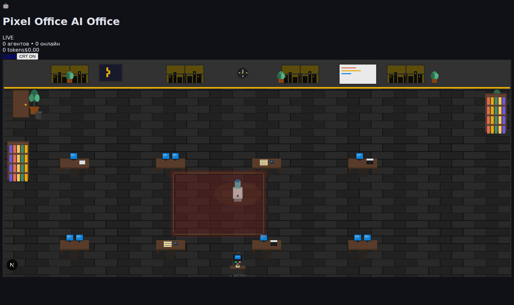
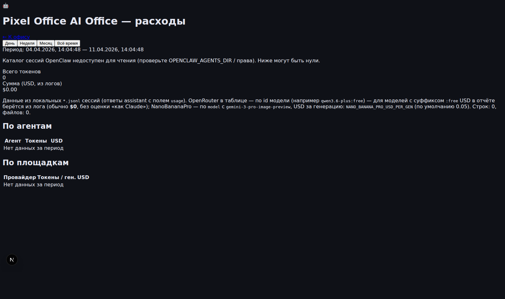

# 🖥️ Pixel Office — OpenClaw AI Agent Dashboard

[](https://github.com/SC32br/openclaw-skill-pixel-office)
[](https://nextjs.org)
[](https://pixijs.com)
[](LICENSE)

**Live pixel-art office dashboard for your OpenClaw AI agents.**  
Each agent appears as an animated pixel character — walking, stretching, meeting, going to the water cooler — with real-time status and an activity feed.

## Screenshots

<p align="center">
  <a href="docs/screenshots/office-stream.png" title="Open full size">
    
  </a>
</p>
<p align="center"><strong>Live office</strong> — <em>Pixi.js scene · agent roster · all-time tokens &amp; USD · Costs link · CRT overlay</em></p>
<br/>
<p align="center">
  <a href="docs/screenshots/office-costs.png" title="Open full size">
    
  </a>
</p>
<p align="center"><strong>Cost report</strong> — <em>time ranges · totals from local session logs · per-agent &amp; per-provider breakdown</em></p>

<p align="center"><sub>Captured from a local dev build (empty agent DB in this shot — connect OpenClaw to see live characters and feed).</sub></p>

<details>
<summary><strong>ASCII wireframe</strong> (concept)</summary>

```
┌─────────────────────────────────────────────────────────────────┐
│  🤖 Pixel Office                                    [LIVE] ●    │
├──────────────────────────────────────┬──────────────────────────┤
│                                      │  👥 Agents               │
│   ┌───┐  ┌───┐  ┌───┐  ┌───┐        │  🤖 Main      ● Working  │
│   │ 💻│  │ 💻│  │ 💻│  │ 💻│        │  📊 Marketer  ● Thinking │
│   └───┘  └───┘  └───┘  └───┘        │  ✍️  Writer    ○ Idle     │
│    [A]    [B]    [C]    [D]          │  📢 Publisher ● Working  │
│                                      │                          │
│   ┌───┐  ┌───┐  ┌───┐  ┌───┐        │  🔴 Live Feed            │
│   │ 💻│  │ 💻│  │ 💻│  │ 💻│        │  14:32 🤖 Processing...  │
│   └───┘  └───┘  └───┘  └───┘        │  14:31 📊 Strategy done  │
│    [E]    [F]    [G]    [H]          │  14:30 ✍️  Post written   │
│                                      │                          │
│         ┌──────────────────┐         │                          │
│         │  🤝 MEETING ROOM  │         │                          │
│         └──────────────────┘         │                          │
│  [LIVE ●]           [🤝 Gather All]  │                          │
└──────────────────────────────────────┴──────────────────────────┘
```

</details>

---

## Requirements

- **Node.js 20+** — required for `better-sqlite3`, `@tailwindcss/oxide`, and Next.js 16
  ```bash
  node --version  # must be v20.x or v22.x
  # nvm users: nvm install 22 && nvm use 22
  ```
- nginx (for reverse proxy)
- OpenClaw Gateway running locally

## Quick Start

```bash
# 1. Clone
git clone https://github.com/SC32br/openclaw-skill-pixel-office pixel-office
cd pixel-office

# 2. Install deps (Node 20+ required)
npm install

# 3. Configure environment
cp .env.example .env.local
# Edit .env.local — set OPENCLAW_TOKEN and OPENCLAW_GATEWAY_URL

# 4. Create database tables (run once)
npm run db:push

# 5. Build and start
npm run build
npm start
```

## Data Model — Agents vs Bots vs Sessions

Understanding what shows on the map:

```
OpenClaw Workspace
│
├── Sessions (source of truth for the map)
│   └── Fetched via POST /tools/invoke → sessions_list
│   └── Each session with key "agent:main:<label>" = one agent on the map
│
├── Bots (channels — Telegram, MAX, Discord, etc.)
│   └── A bot ≠ an agent. One bot can serve many agents.
│   └── An agent can have zero bots (runs headlessly).
│
└── Workspace folders (your project structure)
    └── Not read directly — only active Gateway sessions appear on map.
```

**Rule:** The number of agents on the map = number of active OpenClaw sessions, not bots or workspace folders.

To populate the map:
1. Set `OPENCLAW_TOKEN` in `.env.local`
2. Start your OpenClaw agents (they register as sessions)
3. Refresh the dashboard

## ⚡ One-Command Install

Just tell your OpenClaw agent:

> **"install pixel office"** or **"установи пиксельный офис"**

The agent will:
1. Clone this repo to `~/agents-workspace/pixel-office`
2. Build the Next.js app
3. Generate a random 8-char password
4. Create a systemd service on port 3001
5. Configure nginx with proper locations
6. Set up HTTP Basic Auth
7. Give you the URL + credentials

Full install instructions are in [SKILL.md](SKILL.md).

---

## 🏗️ Architecture

```
Browser
  └── nginx (your domain)
        ├── /office/*    → proxy :3001  (auth required)
        ├── /_next/*     → proxy :3001  (auth required — serves JS bundles)
        └── /api/*       → proxy :3001  (NO auth — XHR must work)
                                │
                          Next.js :3001
                          ├── /office/stream  → PixelOffice canvas (Pixi.js v8)
                          ├── /api/agents     → SQLite via drizzle-orm
                          ├── /api/activity/feed
                          ├── /api/openclaw/stats → Gateway /api/v1/stats, else sessions, else JSONL
                          └── /api/openclaw/cost-report → local session *.jsonl under ~/.openclaw/agents
                          /office/costs → detailed cost breakdown (same JSONL source)
```

**Stack:**
| Layer | Tech |
|-------|------|
| Frontend | Next.js 16, React 19, Pixi.js v8, Zustand |
| Styling | Tailwind CSS v4 |
| Database | SQLite (better-sqlite3 + drizzle-orm) |
| Auth | nginx HTTP Basic Auth |
| Process | systemd |
| Runtime | Node.js 20+ |

---

## ⚙️ Configuration

Edit `~/agents-workspace/pixel-office/.env.local`:

```env
NODE_ENV=production
PORT=3001

# OpenClaw Gateway — for real token/cost stats (optional)
OPENCLAW_GATEWAY_URL=http://localhost:18789
OPENCLAW_TOKEN=your_openclaw_token

# SQLite database (absolute path recommended in production)
DATABASE_URL=/home/YOUR_LINUX_USER/agents-workspace/pixel-office/data/office.db
```

After changes: `sudo systemctl restart pixel-office`

### Cost report (`/office/costs`)

Token and USD totals in the header and on the costs page are aggregated from local OpenClaw session logs (`*.jsonl` under each agent folder). By default the app reads `~/.openclaw/agents` (or set `OPENCLAW_AGENTS_DIR` / `OPENCLAW_HOME` — see `.env.example`). Optional `OPENCLAW_COST_*_PER_M` env vars tune USD estimates when logs have tokens but no `usage.cost`.

### Adding Your Agents

Agents are stored in the SQLite database. The app reads them from `/api/agents` and maps them to pixel characters on the canvas.

You can insert agents via drizzle migrations or directly with SQLite:

```sql
INSERT INTO agents (id, name, role, emoji, currentStatus)
VALUES ('main', 'Main Agent', 'Coordinator', '🤖', 'idle');
```

---

## 🚀 Manual Install

If you prefer to install manually instead of using the skill:

```bash
# 1. Clone
cd ~/agents-workspace
git clone https://github.com/SC32br/openclaw-skill-pixel-office pixel-office
cd pixel-office

# 2. Build
npm install
npm run build

# 3. Create .env.local
cp .env.example .env.local  # edit as needed

# 4. systemd service
sudo cp deploy/pixel-office.service /etc/systemd/system/
sudo systemctl daemon-reload
sudo systemctl enable --now pixel-office

# 5. nginx — add to your server {} block
# See deploy/nginx-location.conf for the required location blocks

# 6. htpasswd
PASSWORD=$(cat /dev/urandom | tr -dc 'a-zA-Z0-9' | fold -w 8 | head -n 1)
sudo sh -c "echo -n 'office:' >> /etc/nginx/.htpasswd"
sudo sh -c "openssl passwd -apr1 '$PASSWORD' >> /etc/nginx/.htpasswd"
echo "Password: $PASSWORD"

# 7. Reload
sudo nginx -t && sudo systemctl reload nginx
```

---

## 🔧 Troubleshooting

### White screen / Pixi.js not loading
**Cause:** Missing `/_next/` location block in nginx → JS chunks return 404.  
**Fix:** Add the `/_next/` location block from `deploy/nginx-location.conf`.

```bash
# Check browser console for:
# GET https://yourdomain.com/_next/static/chunks/... 404
```

### 0 agents shown in sidebar
**Cause:** `auth_basic` on `/api/` location → XHR gets 401.  
**Fix:** Remove `auth_basic` from the `/api/` location block.

### Service not starting
```bash
sudo journalctl -u pixel-office -n 50 --no-pager
```

### Port conflict
```bash
sudo lsof -i :3001
# Change PORT in .env.local and update nginx proxy_pass
```

### Build errors
```bash
node --version  # must be ≥ 18.x
npm install
npm run build 2>&1 | tail -40
```

---

## 📁 Project Structure

```
pixel-office/
├── SKILL.md                    # OpenClaw auto-installer
├── deploy/
│   ├── nginx-location.conf     # nginx location blocks (copy into server {})
│   └── pixel-office.service    # systemd service unit
├── src/
│   ├── app/
│   │   ├── api/
│   │   │   ├── agents/         # GET /api/agents → SQLite
│   │   │   ├── activity/feed/  # GET /api/activity/feed
│   │   │   └── openclaw/stats/ # GET /api/openclaw/stats → Gateway
│   │   ├── office/stream/      # Main dashboard page
│   │   └── stream/             # Alt stream route
│   ├── components/office/
│   │   ├── PixelOffice.tsx     # Main Pixi.js canvas component
│   │   ├── drawAgent.ts        # Pixel character rendering
│   │   └── drawOffice.ts       # Office environment (desks, rooms)
│   ├── lib/db/                 # drizzle-orm schema + SQLite client
│   ├── stores/                 # Zustand stores (agents, auth, ui)
│   └── middleware.ts           # Rate limiting + auth middleware
└── package.json
```

---

## 🎨 Customization

### Change the emoji / agent appearance
Edit `src/components/office/drawAgent.ts` — each agent ID maps to a color scheme and pixel sprite style.

### Add more desk positions
Edit `DESK_GRID` / `buildDeskPositions()` in `src/components/office/drawOffice.ts` (see `PixelOffice.tsx` for how positions bind to agents).

### Change the port
Update `PORT` in `.env.local`, the systemd service file, and nginx `proxy_pass`.

---

## 📄 License

MIT — free to use, modify, and deploy.

---

*Part of the [OpenClaw](https://openclaw.io) skills ecosystem.*


---

## OpenClaw Gateway API Contract

All Gateway calls go through `src/lib/openclaw-gateway.ts`. Never call Gateway directly from UI or routes.

### Endpoint

```
POST http://localhost:18789/tools/invoke
Authorization: Bearer <OPENCLAW_TOKEN>
Content-Type: application/json
```

### Request

```json
{ "tool": "sessions_list", "params": {} }
```

### Response — success

```json
{
  "ok": true,
  "result": {
    "details": {
      "count": 3,
      "sessions": [
        {
          "key": "agent:main:my-agent",
          "kind": "other",
          "channel": "unknown",
          "displayName": "my-agent",
          "status": "working",
          "contextTokens": 45000,
          "totalTokens": 120000,
          "estimatedCostUsd": 0.012,
          "updatedAt": 1743000000000
        }
      ]
    }
  }
}
```

### Session key format

```
agent : main : <label>
  │       │       └─ agent label (used as agent ID on the map)
  │       └─ agent group (always "main" for primary agents)
  └─ prefix (always "agent")
```

### Error responses

| HTTP | Meaning | Pixel Office action |
|------|---------|-------------------|
| 401 | Token invalid or missing | Show "token missing" message |
| 429 | Rate limited | Show retry countdown, do not retry immediately |
| 503+ | Gateway down | Show empty office + "Gateway unreachable" |
| `ok: false` | Tool-level error | Log message, return empty list |

### What to filter from sessions

| Condition | Reason |
|-----------|--------|
| `key` does not start with `agent:` | System or internal session |
| `key` contains `:subagent:` | Spawned sub-agent, not a main agent |
| `displayName === "heartbeat"` | Periodic health-check session |

### Logging (structured, no token leakage)

The adapter logs:
- `[gateway] unreachable: <message>` — connection error
- `[gateway] 401 Unauthorized` — bad token (token value never logged)
- `[gateway] 429 Rate limited` — with retry-after if available
- `[gateway] HTTP <status>: <first 200 chars of body>` — unexpected errors
- `[gateway] unknown top-level field: "<field>"` — forward-compat warning

---

## Troubleshooting

### 🔴 Empty office — no agents on the map

**Check 1 — Token set?**
```bash
grep OPENCLAW_TOKEN .env.local
# Must not be empty
```

**Check 2 — Gateway running?**
```bash
curl -s http://localhost:18789/tools/invoke \
  -X POST -H "Authorization: Bearer $OPENCLAW_TOKEN" \
  -H "Content-Type: application/json" \
  -d '{"tool":"sessions_list","params":{}}' | jq .
```
Expected: `{"ok":true,"result":{"details":{"sessions":[...]}}}`

**Check 3 — Are agents active?**
Sessions only appear while agents are running. Start your OpenClaw agents, then refresh.

---

### 🔴 Gateway 404 on old paths

**Symptom:** `curl http://localhost:18789/api/v1/sessions/list` → 404

**Cause:** This path does not exist in OpenClaw Gateway.

**Fix:** Pixel Office uses `POST /tools/invoke` with `tool: "sessions_list"` — see `src/lib/openclaw-gateway.ts`.
Never call `/api/v1/*` directly.

---

### 🔴 White screen / Pixi.js fails to load

**Cause:** `/_next/static/*.js` chunks routed to gateway (port 18789) instead of Next.js (port 3001).

**Fix:** Add this nginx block **before** your `/office/` location:
```nginx
location ^~ /_next/ {
    auth_basic "Pixel Office";
    auth_basic_user_file /etc/nginx/.htpasswd;
    proxy_pass http://127.0.0.1:3001;
}
```
Full config: see `deploy/nginx-location.conf`.

---

### 🔴 `/office/costs` 404 behind nginx

**Cause:** An old config used `rewrite ^/office/(.*)$ /$1 break;`, which turned `/office/costs` into `/costs` — but the app only serves `/office/costs`.

**Fix:** Remove that `rewrite` and proxy `/office/` to Next.js with the path unchanged (see current `deploy/nginx-location.conf`).

---

### 🔴 0 agents shown — `/api/agents` returns 401

**Cause:** `auth_basic` applied to `/api/` location — browser XHR does not send Basic Auth credentials.

**Fix:** Remove `auth_basic` from `location ^~ /api/` — Next.js middleware handles auth internally.

---

### 🔴 Service fails to start — `node: command not found`

**Cause:** `/usr/bin/node` missing or old version when using nvm.

**Fix:** Check your node path and update the service:
```bash
which node   # e.g. ~/.nvm/versions/node/v22.x.x/bin/node
```
Then edit `deploy/pixel-office.service` — `ExecStart` uses `$(which node)` by default.
After editing: `sudo systemctl daemon-reload && sudo systemctl restart pixel-office`

---

### 🔴 `db:push` fails — missing drizzle.config.ts

```bash
# Verify the file exists
ls drizzle.config.ts

# Run push
npm run db:push

# Verify tables created
sqlite3 data/office.db ".tables"
```

---

### 🟡 Gateway 429 — rate limited

The adapter backs off automatically and returns an error message to the UI.
Check your OpenClaw agent loop frequency — avoid polling faster than every 5 seconds.

---

### 🟡 Node version error during `npm install`

```
error: @tailwindcss/oxide requires Node 20+
```

```bash
node --version        # check current
nvm install 22        # install Node 22 LTS
nvm use 22
npm install           # retry
```

---

### Smoke test after deploy

```bash
# 1. API responds (no nginx auth on /api/)
curl -s http://localhost:3001/api/agents | jq .

# 2. Through nginx
curl -s -u office:your_password https://yourdomain.com/api/agents | jq .

# 3. Gateway integration
curl -s http://localhost:3001/api/openclaw/sessions | jq .agents
```
